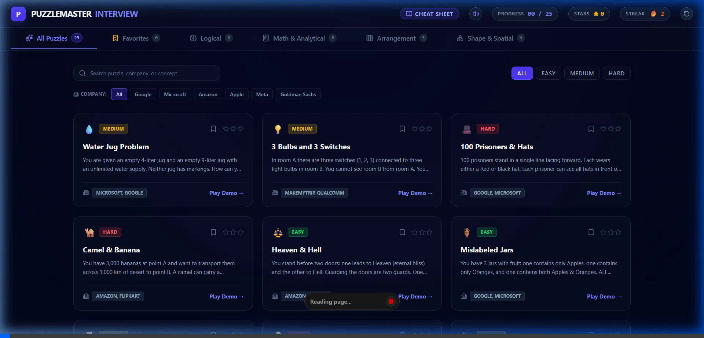
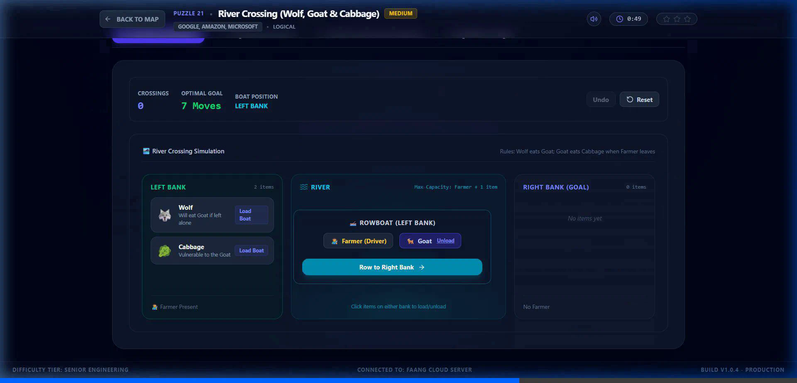
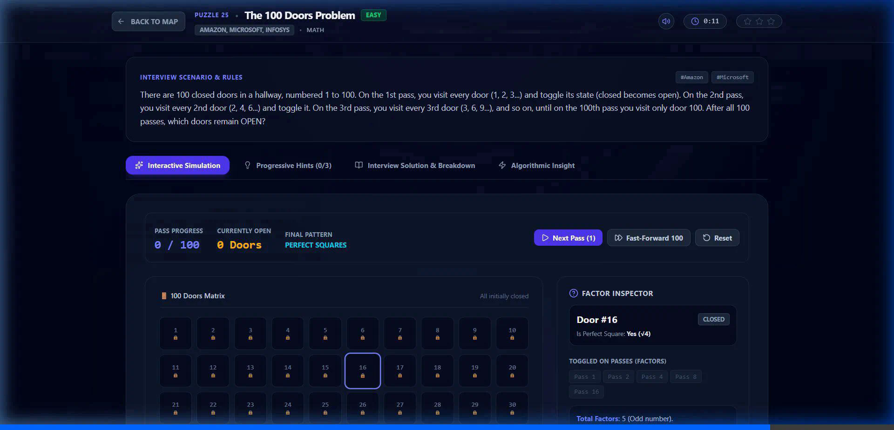
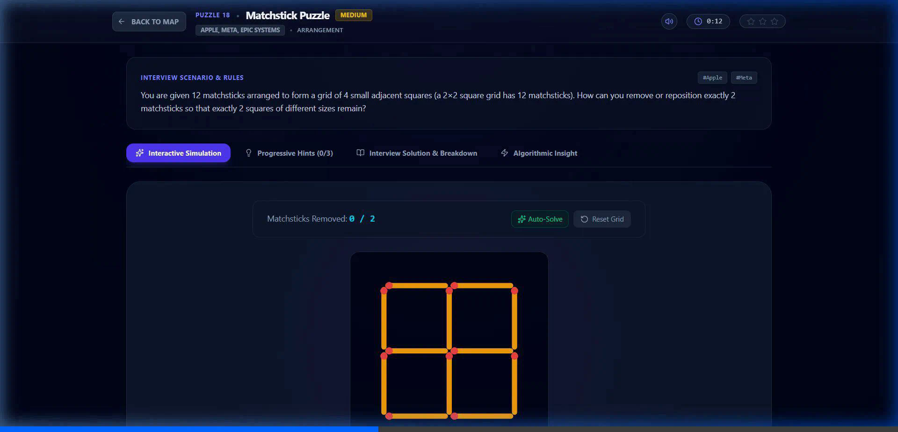
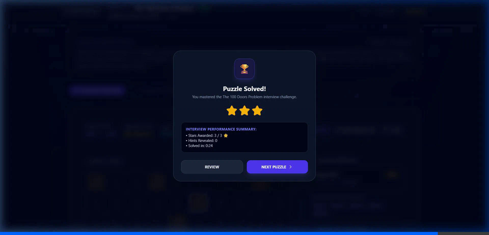

# 🧩 PuzzleMaster: Interview Edition

<p align="center">
  
  
  
  
  
  
</p>

An interactive, gamified web platform for mastering classic **FAANG & Tier-1 tech interview puzzles**. Rather than just reading static answers, candidates can play through **custom visual simulations**, experiment with constraints, test hypotheses in real-time, and unlock progressive hints, formal mathematical proofs, and algorithmic insights.

---

## 📸 Screenshots

### 1. Level Map & Dashboard
Explore all 25 puzzles categorized by logic, math, arrangement, and spatial reasoning. Filter instantly by target employer (**Google**, **Microsoft**, **Amazon**, **Apple**, **Meta**, **Goldman Sachs**) and bookmark favorite puzzles.



---

### 2. Inside the Puzzles: Interactive Mini-Games

Every single puzzle includes a dedicated, responsive simulation built specifically for its constraints:

#### 🛶 River Crossing (Wolf, Goat & Cabbage) — Puzzle #21
A real-time river simulation with a Left Bank, Right Bank, and Rowboat. Enforces predator-prey rules and safe transport sequences.



#### 🚪 The 100 Doors Problem — Puzzle #25
A 10×10 visual door matrix simulation with step-by-step pass controls, fast-forward automation, and a dynamic Divisor Factor Inspector explaining factor parity.



#### 🥢 Matchstick Puzzle — Puzzle #18
Interactive 2×2 geometric grid where players reposition matchsticks to discover nested multi-scale squares.



#### 🏆 Star Rewards & Performance Summary
Track your moves, time, and stars earned upon mastering each challenge.



---

## 📚 Complete Question Catalog (25 Puzzles)

| # | Puzzle Name | Category | Difficulty | Companies | Core Algorithmic Concept |
|---|---|---|---|---|---|
| **1** | **Water Jug Problem** | 🧠 Logical | Medium | Google, Microsoft, Goldman Sachs | Extended Euclidean & Bézout's Identity ($ax + by = d$) |
| **2** | **3 Bulbs and 3 Switches** | 🧠 Logical | Medium | Amazon, Qualcomm, MakeMyTrip | State Expansion via Thermal Physics (3-state encoding) |
| **3** | **Monty Hall Problem** | 📐 Math | Medium | Meta, Netflix, VMware | Bayesian Updating & Conditional Probability ($P = 2/3$) |
| **4** | **2 Eggs & 100 Floors** | 📐 Math | Hard | Google, Microsoft, Uber | Minimax Search & Triangular Numbers ($\frac{x(x+1)}{2} \ge 100$) |
| **5** | **Torch & Bridge** | 📐 Math | Medium | Google, Microsoft, Adobe | Greedy Pitfall & Slower Pair Parallelism (17 minutes) |
| **6** | **3 Ants on a Triangle** | 🔷 Spatial | Easy | Amazon, Intuit, ZS Associates | Independence Combinatorics ($2/2^n = 1/4$) |
| **7** | **Chessboard & Dominos** | 🔷 Spatial | Medium | Google, Palantir, Jane Street | Coloring Invariant & Graph Bipartite Matching |
| **8** | **3 Cuts for 8 Cake Pieces** | 🔷 Spatial | Medium | Adobe, Cognizant, Accenture | 3D Spatial Partitioning (Euler characteristics) |
| **9** | **50 Red & 50 Blue Marbles** | 📐 Math | Medium | Google, Microsoft, Twitter | Asymmetric Probability Maximization ($P \approx 74.7\%$) |
| **10** | **Days of Month with 2 Dice** | 🎯 Arrangement | Medium | Microsoft, Amazon, Morgan Stanley | Symmetry & Resource Folding ($6 \to 9$ inversion) |
| **11** | **10 Balls in 5 Lines** | 🎯 Arrangement | Hard | Deloitte, Cognizant, Publicis | Projective Geometry & Pentagram Dual Intersections |
| **12** | **Snail & Wall** | 📐 Math | Easy | TCS, Infosys, Wipro | Termination Check Before Loop Decrement (Off-by-one) |
| **13** | **Mislabeled Jars** | 🧠 Logical | Easy | Google, Microsoft, Apple | Constraint Satisfaction (Highest degree of constraint) |
| **14** | **100 Prisoners & Hats** | 🧠 Logical | Hard | Google, Microsoft, Palantir | Parity Bit & XOR Error Detection (Hamming Codes) |
| **15** | **Heaven & Hell** | 🧠 Logical | Easy | Amazon, Infosys, Bloomberg | Boolean Logic Involution & Inverting Gate Composition |
| **16** | **Camel & Banana** | 🧠 Logical | Hard | Amazon, Flipkart | Piecewise Linear Optimization & Dynamic Checkpoints |
| **17** | **Poison & Rat (Binary Bottles)** | 📐 Math | Hard | Amazon, Meta, Goldman Sachs | Information Theory & Binary Encoding ($2^k \ge N$) |
| **18** | **Matchstick Puzzle** | 🎯 Arrangement | Medium | Apple, Meta, Epic Systems | Multi-scale Geometric Reframing |
| **19** | **Round Table Coin Game** | 🎯 Arrangement | Medium | Goldman Sachs, Morgan Stanley | Game Theory & Point-Symmetric Invariants |
| **20** | **9 Dots Puzzle** | 🔷 Spatial | Medium | Apple, IDEO, Disney | Lateral Thinking & Boundary Constraint Elimination |
| **21** | **River Crossing (Wolf, Goat, Cabbage)** | 🧠 Logical | Medium | Google, Amazon, Microsoft | State-Space Graph Traversal & Backtracking |
| **22** | **Counterfeit Coin & Balance Scale** | 📐 Math | Hard | Goldman Sachs, Microsoft, Palantir | Ternary Search Trees & Scale Balancing ($3^k \ge N$) |
| **23** | **Burning Ropes (Measure 45 Min)** | 🧠 Logical | Medium | Google, Bloomberg, Apple | Non-Uniform Rate Integration & Flame Invariants |
| **24** | **Tower of Hanoi** | 🎯 Arrangement | Medium | Microsoft, Amazon, Cisco | Divide & Conquer Recursion ($T(n) = 2^n - 1$) |
| **25** | **The 100 Doors Problem** | 📐 Math | Easy | Amazon, Microsoft, Infosys | Number Theory & Divisor Parity (Square numbers) |

---

## ✨ Key Features

- **🎮 25 Interactive Simulations:** Custom interactive game demos for all 25 puzzles with move tracking, resets, and undo support.
- **💡 3-Tier Progressive Hints:** Gradually reveals clues without spoiling the core breakthrough.
- **📐 Mathematical Proofs & Interview Breakdowns:** Rigorous formal explanations and edge case analysis.
- **⚡ Algorithmic Insights:** Connects each puzzle directly to data structures and algorithms (graphs, DP, binary search, information theory).
- **🔊 Web Audio Synthesizer:** Real-time sound effects for moves, hint reveals, and victory fanfares (zero external audio assets needed) with a one-click mute toggle.
- **🏷️ Company Quick Filters:** Filter questions asked at Google, Microsoft, Amazon, Apple, Meta, and Goldman Sachs.
- **⭐ Favorites & Bookmarking:** Save challenging puzzles to review before your interview rounds.
- **📋 Formula & Logic Cheat Sheet Modal:** Quick-reference cheat sheet for Bézout's identity, Bayes' theorem, ternary scale bounds, and factor parity.

---

## 🚀 Getting Started

### Prerequisites
- [Node.js](https://nodejs.org/) (version 18 or higher recommended)
- `npm` or `bun`

### Installation

1. **Clone the repository:**
   ```bash
   git clone https://github.com/Suraj6769/Puzzle-Interview-Question.git
   cd Puzzle-Interview-Question
   ```

2. **Install dependencies:**
   ```bash
   npm install
   ```

3. **Run the development server:**
   ```bash
   npm run dev
   ```
   Open [http://localhost:3000](http://localhost:3000) in your browser.

4. **Build for production:**
   ```bash
   npm run build
   ```

5. **Type check & Lint:**
   ```bash
   npm run lint
   ```

---

## 🛠️ Technology Stack

- **Frontend Framework:** [React 19](https://react.dev/)
- **Language:** [TypeScript 5.8](https://www.typescriptlang.org/)
- **Styling:** [Tailwind CSS v4](https://tailwindcss.com/)
- **Bundler & Dev Server:** [Vite 6](https://vitejs.dev/)
- **Icons:** [Lucide React](https://lucide.dev/)
- **Visual Effects:** [Canvas Confetti](https://www.npmjs.com/package/canvas-confetti)
- **Audio Engine:** Native Web Audio API Synthesizer

---

## 📄 License

This project is licensed under the Apache-2.0 License.
